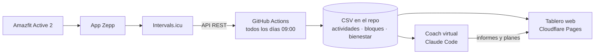

# Entrenamiento: de mi reloj a un tablero con coach virtual

Proyecto personal para registrar, visualizar y planificar mi entrenamiento (carrera y pádel)
a partir de los datos de mi reloj, con actualización automática diaria y un coach virtual
basado en IA.

> 🚧 En construcción. Ver [la bitácora](docs/bitacora.md) para el recorrido del proyecto.

## Arquitectura



## Estructura

| Carpeta | Contenido |
|---|---|
| `scripts/` | Descarga de datos desde la API de Intervals.icu (Python) |
| `datos/` | Datos históricos en CSV, actualizados automáticamente |
| `.github/workflows/` | Workflow de actualización diaria |
| `app/` | Tablero web |
| `coach/` | Coach virtual: ficha del atleta, comandos, informes y planes |
| `docs/` | Bitácora y decisiones del proyecto |

## Herramientas

- **Intervals.icu API**: fuente de datos (actividades, vueltas y bienestar).
- **Python**: extracción y transformación a CSV.
- **GitHub Actions**: automatización diaria.
- **Cloudflare Pages**: publicación del tablero.
- **Claude Code**: desarrollo asistido del tablero y coach virtual.

## Uso local

```bash
pip install -r requirements.txt
python scripts/historico.py 2026-07-10   # carga inicial (una sola vez)
python scripts/diario.py                 # últimos 7 días hasta ayer
```

La primera ejecución local pide el Athlete ID y la API key de Intervals.icu y los guarda en
`config.json` (excluido del repositorio). En GitHub Actions se leen de los secretos
`INTERVALS_ATHLETE_ID` e `INTERVALS_API_KEY`.
